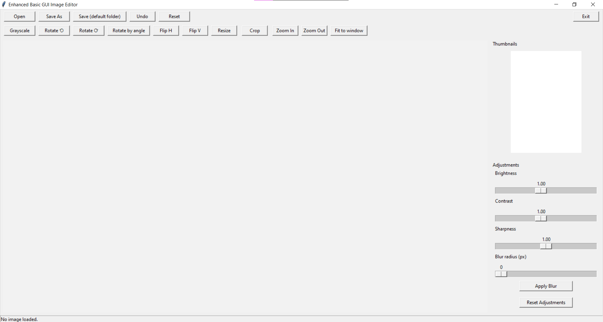
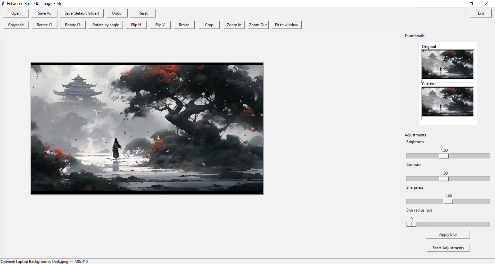
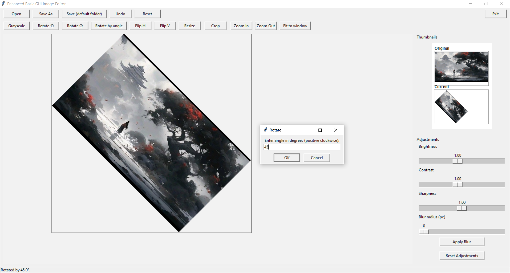
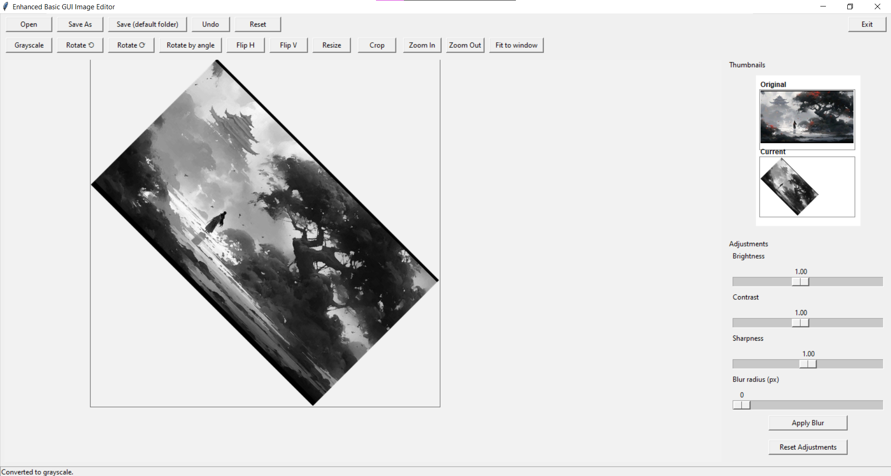

# Enhanced Basic GUI Image Editor

A desktop image editor built with **Python**, **Tkinter**, and **Pillow (PIL)**. It provides a simple GUI for common image editing tasks — adjustments, transforms, cropping, and zooming — with undo/reset support and live thumbnails.


---

## Screenshots and output

<p align="center">
  
  
</p>
<p align="center">
  
  
</p>

---

## Features

- **File operations**
  - Open an image (`PNG`, `JPG/JPEG`, `BMP`, `GIF`, `TIFF`)
  - Save As (choose path and format)
  - Quick Save to a default `output/edited_images` folder (auto-incrementing filename)
- **Adjustments (live preview via sliders)**
  - Brightness
  - Contrast
  - Sharpness
  - Gaussian Blur (radius slider + Apply Blur button)
- **Transforms**
  - Grayscale conversion (alpha-safe)
  - Rotate 90° left/right, or by a custom angle
  - Flip horizontal / vertical
  - Resize by percentage or exact `WxH` dimensions
- **Crop tool** — drag directly on the canvas to select and crop an area
- **Zoom controls** — Zoom In, Zoom Out, Fit to Window
- **Thumbnails panel** — clickable "Original" and "Current" thumbnails for quick comparison/reset
- **Undo (single-step)** and **Reset to original**
- **Keyboard shortcuts**:
  - `Ctrl+O` — Open
  - `Ctrl+S` — Save As
  - `Ctrl+Z` — Undo
  - `Ctrl+Q` — Quit

---

## Requirements

- Python 3.x
- [Pillow](https://pypi.org/project/Pillow/)
- Tkinter (usually bundled with Python; on Linux you may need to install it separately, e.g. `sudo apt install python3-tk`)

---

## Installation

```bash
git clone https://github.com/0ByteBuilder1/IMAGE-EDITOR.git
cd IMAGE-EDITOR
pip install pillow
```

## Usage

```bash
python image_editor.py
```

1. Click **Open** to load an image.
2. Use the sliders on the right to preview brightness/contrast/sharpness adjustments.
3. Use the toolbar buttons for grayscale, rotate, flip, resize, or crop.
4. Click **Save As** or **Save (default folder)** to export your edited image.
5. Use **Undo** to step back one action, or **Reset** to return to the original image.

---

## Project Structure

```
.
├── image_editor.py
└── output/
    └── edited_images/   # created automatically on first save (Quick Save)
```

> Note: the default save folder is created relative to the script's location, one level up (`../output/edited_images`), so it lands next to the project root if `image_editor.py` lives inside a `src/` folder.

---

## Notes

- Brightness/Contrast/Sharpness sliders apply a **live preview only** — they don't permanently modify the image until you Save or perform another operation (like blur, crop, or a transform).
- Undo supports a single step back (not a full history stack).
- JPEG exports automatically flatten transparency onto a white background, since JPEG doesn't support alpha channels.

---

## License

[MIT](LICENSE) — feel free to update this section based on how you'd like to license the project.

---

## Details
INTERN ID : CITS3134 | 
NAME      : YES CHANDRA |
DURATION  : 4 WEEKS |
PROJECT NAME : Image Processor (Pillow) |

---
